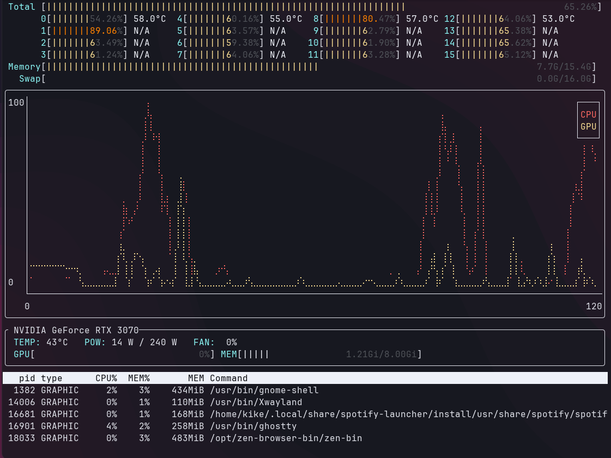

# mltop



## Introduction

**mltop** is a resource monitoring tool designed specifically for Machine Learning Engineers and those working with ML tasks. It was a born as a hybrid of `nvtop` (for monitoring NVIDIA GPUs) and `htop` (for monitoring CPU and other system resources), allowing users to see a comprehensive view of their system’s performance in a single interface.

### Key Features

- Dual Resource Monitoring: Overlays CPU and GPU usage for spotting bottlenecks in your dataloader pipelines.
- Simplified UI: Combines the best features of htop and nvtop, so you don't need to open multiple tools.

--- 

**mltop** requires NVIDIA drivers to monitor NVIDIA GPU information.

**mltop** is written in Rust.


## Installation

You can easily install mltop via pre-built binaries or by compiling from source.

### Pre-built Binaries

- Visit the releases page to download the latest precompiled binaries for your operating system.

### Building from Source

1. Make sure you have Rust (Cargo) installed.

2. Clone the repository:

```bash
git clone https://github.com/yourusername/mltop.git
cd mltop
```

3. Build the project:

```bash
cargo build --release
```

4. Run the tool:

```bash
cargo run
```

## Dependencies

- NVIDIA Drivers: **mltop** uses [nvml_wrapper](https://github.com/rust-nvml/nvml-wrapper) to fetch NVIDIA GPU information, which requires
interfacing with your NVIDIA Drivers. If those are not available, **mltop** won't be able to find your GPU.

Currently, only NVIDIA GPUs are supported, but support for different GPUs is planned.

## Usage

Once installed, run `mltop` in your terminal. The tool will display real-time usage statistics for both CPU and NVIDIA GPUs. Press `q` to quit.


## Example

```
$ mltop
 Total [||||||                                                                                       6.58%]
      0[|||    23.14%] 42.0°C  4[|       6.45%] 33.0°C  8[        3.23%] 31.0°C 12[        2.40%] 35.0°C
      1[        2.42%] N/A     5[        1.60%] N/A     9[        0.00%] N/A    13[        3.20%] N/A
      2[||     16.80%] N/A     6[|||    20.00%] N/A    10[|       4.80%] N/A    14[        1.60%] N/A
      3[        0.81%] N/A     7[||     12.90%] N/A    11[        1.60%] N/A    15[        3.23%] N/A
  Memory[|||||||||||||||||||||||||||||||||||||||||||||||||||||||||||                            9.3G/15.4G]
    Swap[                                                                                       0.0G/16.0G]
╭──────────────────────────────────────────────────────────────────────────────────────────────────────────╮
│100│                          ⡆                                                                      ┌───┐│
│   │                          ⣷                                               ⡇                      │CPU││
│   │                         ⢸⢸⢠                       ⢠                      ⣷ ⡄                    │GPU││
│   │                         ⢸⠈⡾⡀                      ⢸⡄⡀                   ⢀⢿⢰⡇                    └───┘│
│   │                         ⢸ ⠁⡇       ⡆              ⡇⠉⡇                   ⢸⠈⡞⡇    ⡀                    │
│   │                         ⡜  ⡇       ⡇              ⡇ ⡇                   ⢸ ⠁⢇    ⡇                    │
│   │                       ⢀ ⡇  ⢱       ⡇            ⡀ ⡇ ⢸                   ⢸  ⢸   ⢠⡇                    │
│   │                       ⡸⡀⡇  ⢸      ⢰⢹            ⡇⢸  ⢸                 ⡼⡀⡇  ⢸   ⢸⢣                    │
│   │                       ⡇⣧⠃   ⡇     ⢸⢸           ⢰⢣⡸  ⢸                 ⡇⢧⠃  ⢸   ⢸⢸      ⢰             │
│   │                      ⢠⠃⢹    ⢱     ⢰⢸           ⢸⢸⠇  ⢸                ⢠⠃⠈    ⢣  ⡜⢸      ⢸⡆            │
│   │                      ⢸      ⠸⡀    ⢸⢸           ⢸⠈    ⡇     ⢸         ⢸      ⠸⡀ ⡇⢸      ⡎⡇            │
│   │                      ⡜  ⡆    ⡇    ⡟⡄           ⡇    ⢀⡇     ⢸⡄        ⢸       ⡇ ⡇⢸      ⡇⢱            │
│   │                      ⡇ ⢀⢧   ⢰⢣    ⡇⡇⡆          ⡇   ⣄⡸⡇     ⢸⡇        ⢸       ⡇ ⣧⠘⡄     ⡇⢸            │
│   │   ⡤⠤⠤⠤⠤⠤⠤⠤⠤⠤⠤⡄ ⡤⢤   ⢠⠃ ⢸⢸   ⡎⡇   ⢀⡇⡇⡇ ⢠   ⡄⢠⢤ ⢰⠁  ⢸ ⠁⢱     ⡇⡇        ⡜  ⡼⡀   ⢸⢸⡇⡇⡇     ⡇⢆⡇       ⢸⡀  │
│   │⢠⠔⢀⠇⠒⠊⠑⡄⡤⠒⠢⡀⢀⣠⢱⢰⠁⢀⢇ ⢀⠜ ⢀⠎⠘⣄⠶⡀⡇⢸⣇⡀⢀⢸ ⢸⡧⢦⡜⡄ ⡸⠘⡎⡆⢇⡀⢠⠛⡄⡇  ⢸     ⡇⢣     ⢀  ⡇ ⢠⠃⢇   ⠈⢸ ⢸⡇⢀   ⢸⠇⠈⡇       ⡜⡇⢀ │
│0  │⣀⣀⣸    ⠈   ⠈⠁ ⠈⡎⠈⠁⠈⠱⣀⠤⠤⠃  ⠋ ⢻  ⠓⠤⠃⠻  ⠓⠴⠁⠘⠒⠱⡰⠁⠱⢤⠳⡜ ⢳⠁  ⠈⠢⢄⣀⣀⣀⡇⢸⣀⡰⠱⣀⣀⠎⢆⣀⣀⢄⠎ ⠘⡤⠢⢄⡠⠼ ⠈⣆⣀⣀⣀⣀⣸  ⢸⣀⣀⣀⡠⢄⣀⣀⠇⢱⠎ │
│   └──────────────────────────────────────────────────────────────────────────────────────────────────────│
│   0                                                                                                   120│
╰──────────────────────────────────────────────────────────────────────────────────────────────────────────╯
╭ NVIDIA GeForce RTX 3070──────────────────────────────────────────────────────────────────────────────────╮
│ TEMP: 50°C   POW: 48 W / 240 W   FAN:  0%                                                                │
│ GPU[||                           5%] MEM[|||||             1.36Gi/8.00Gi]                                │
╰──────────────────────────────────────────────────────────────────────────────────────────────────────────╯
   pid type      CPU%  MEM%       MEM Command
  1382 GRAPHIC    26%    3%    477MiB /usr/bin/gnome-shell
 14006 GRAPHIC     1%    1%    170MiB /usr/bin/Xwayland
 18033 GRAPHIC     0%    5%    827MiB /opt/zen-browser-bin/zen-bin
 30704 GRAPHIC    46%    2%    283MiB /usr/bin/ghostty
```

## Roadmap

- Sorting processes by GPU/CPU/MEM usage
- Killing processes
- Support for multiple GPU vendors (AMD, Intel, etc.)
- Improved UI/UX with additional customization options.

## Contributing

We welcome contributions to mltop! If you'd like to contribute, please follow these steps:

- Fork the repository.
- Clone your fork and create a new branch.
- Make your changes and add tests if applicable.
- Commit your changes with clear messages.
- Submit a pull request.

## Code of Conduct

By contributing to this project, you agree to abide by the Code of Conduct.

## License

This project is licensed under the MIT License. See the [LICENSE](./LICENSE.MD) file for details.

## Acknowledgments

- Thanks to the creators of htop, nvtop, for for inspiring this project, and to the developers
of `crossterm`, `ratatui`, `sysinfo` & `nvml_wrapper` for providing the building blocks.

## Contact
For any questions or feedback, feel free to reach out via GitHub Issues.
