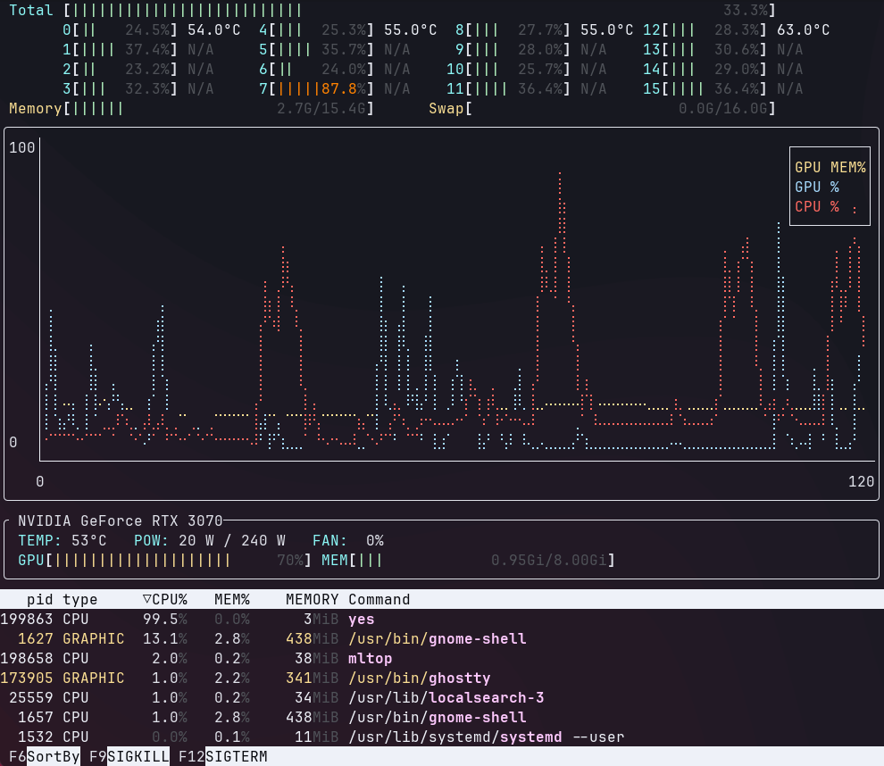

<div align="center">

# mltop

A resource monitoring tool designed for working with Machine Learning tasks  
**CPU & GPU at a glance**


[](https://crates.io/crates/mltop)

</div>



## Introduction

**mltop** is a resource monitoring tool designed specifically for Machine Learning Engineers and those working with ML tasks. It was a born as a hybrid of [nvtop](https://github.com/Syllo/nvtop) (for monitoring GPUs) and [htop](https://github.com/htop-dev/htop) (for monitoring CPU and memory), allowing users to see a comprehensive view of their system’s performance in a single interface.

### Key Features

- Dual Resource Monitoring: Overlays CPU and GPU usage for spotting bottlenecks in your dataloader pipelines.
- Simplified UI: Combines the key features of `htop` and `nvtop`, so you don't need to open multiple tools.

--- 

**mltop** requires NVIDIA drivers to monitor NVIDIA GPU information.

## Installation

You can install **mltop** using Cargo:

1. Make sure you have Rust (Cargo) installed.
2. Clone the repository:
```bash
git clone https://github.com/kikefdezl/mltop.git
```

3. Build & run the project:
```bash
cd mltop
cargo build --release
```

This will compile the binary into `target/release/mltop`.

Pre-built binaries to be added in the future. In the meantime, please build from source using Cargo.

## Dependencies

- **mltop** uses [nvml_wrapper](https://github.com/rust-nvml/nvml-wrapper) to fetch NVIDIA GPU information, which requires
interfacing with your NVIDIA Drivers. If those are not available, **mltop** won't be able to find your GPU.

Currently, only NVIDIA GPUs are supported, but support for different GPUs is in the roadmap.

## Usage

Once installed, run `mltop` in your terminal. The tool will run until you press `q` to quit.

## Customization

Customization is done via `~/.config/mltop/config.toml`. For theme customization, see [Theme Customization](docs/theme.md).

## Roadmap

- Pre-built binaries
- Support for multiple GPUs
- Support for other GPU vendors (AMD, Intel, etc.)

## Contributing

I welcome contributions to **mltop**! Especially those aimed towards supporting hardware I don't have access to. If you'd like to contribute, please follow these steps:

- Fork the repository.
- Clone your fork and create a new branch.
- Make your changes and add tests if applicable.
- Commit your changes with clear messages.
- Submit a pull request.

## License

This project is licensed under the MIT License. See the [LICENSE](./LICENSE.MD) file for details.

## Acknowledgments

- Thanks to the creators of [htop](https://github.com/htop-dev/htop), [nvtop](https://github.com/Syllo/nvtop), for for inspiring this project, and to the developers
of `crossterm`, `ratatui`, `sysinfo` & `nvml_wrapper` for providing the building blocks.

## Contact
For any questions or feedback, feel free to reach out via GitHub Issues.
